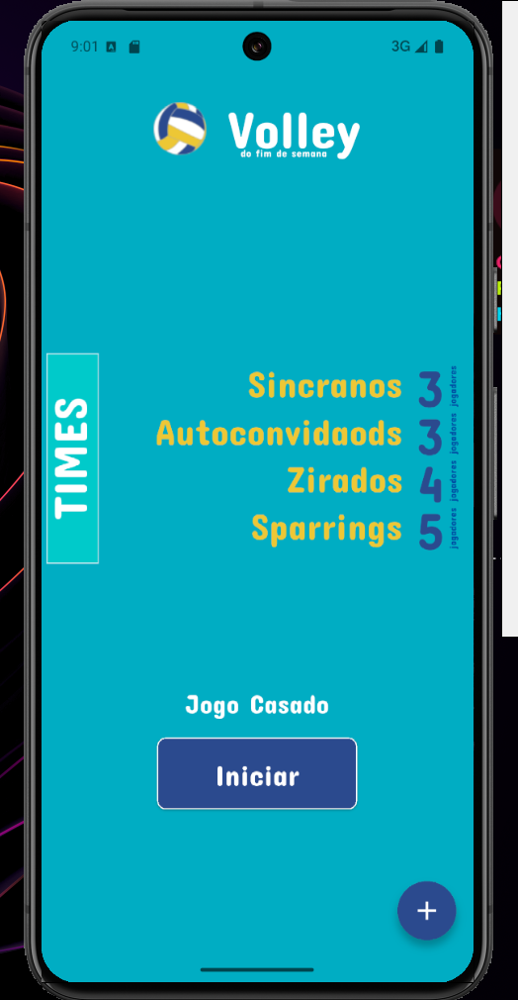
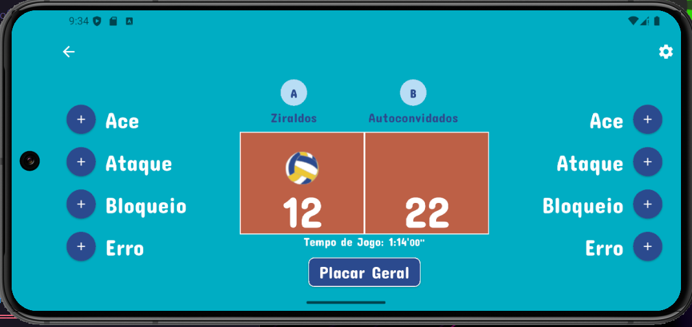
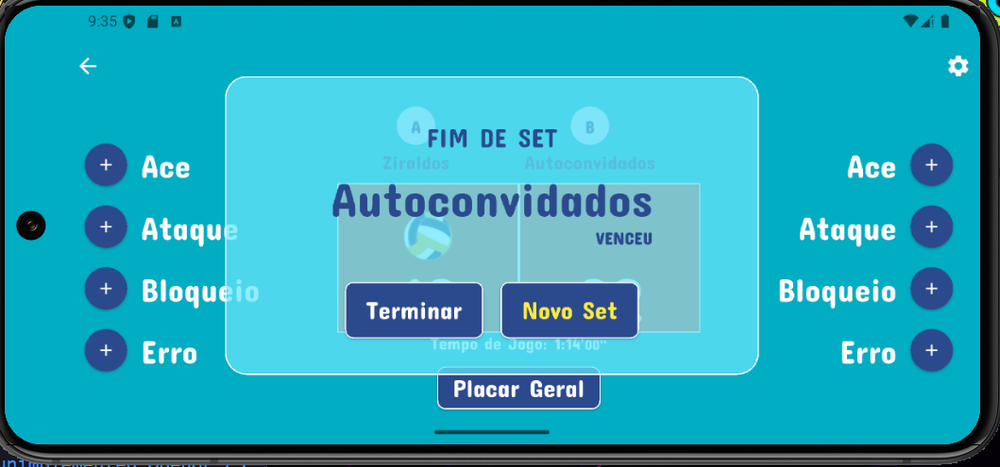
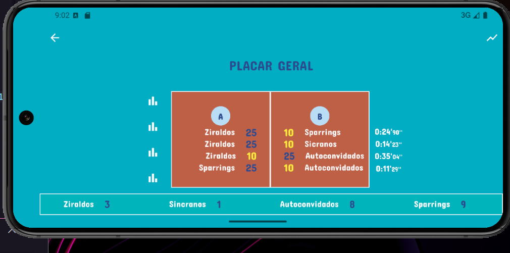
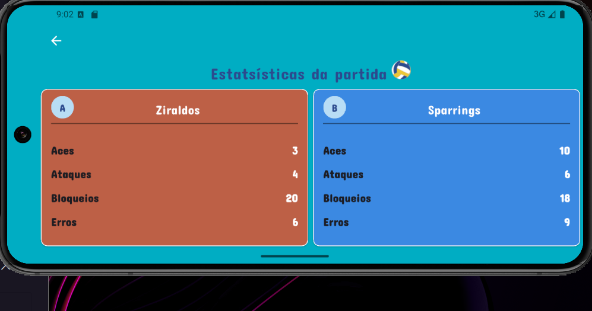

# Volley_app

Este projeto Flutter consiste apenas no layout de um app de Vôlei fictício.

O foco está na construção das telas e no design da interface do usuário. Nenhuma lógica de negócios, armazenamento de dados ou controle de partidas foi implementado — este é um projeto puramente visual.

## Telas
Tela Inicial

Descrição: Tela com o nome do app, botão de início e logotipo.

Tela de Sets e Pontuação

Descrição: Interface de controle dos sets, com botões de pontuação para cada time.

Tela de Resultado do Set

Descrição: Exibe a equipe vendedora

Tela de Placar Geral

Descrição: Exibe um resumo visual dos sets e pontuações acumuladas.

Tela de Estatísticas da Partida

Descrição: Mostra estatísticas individuais de uma única partida (Aces, Ataques, Bloqueios e Erros).

